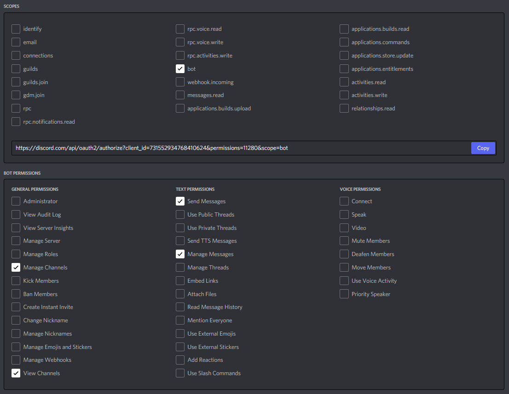

## セットアップ
1. DiscordTokenを取得します。以下の権限を持つbotアカウントを用意しましょう。

2. 以下のファイルをリネームしましょう。
  - config.yml.sample -> config.yml
3. config.ymlの`discord_token`に、取得したDiscordTokenを記入し、保存しましょう。

## 起動方法
```bash
$ docker-compose up
```
で起動します。